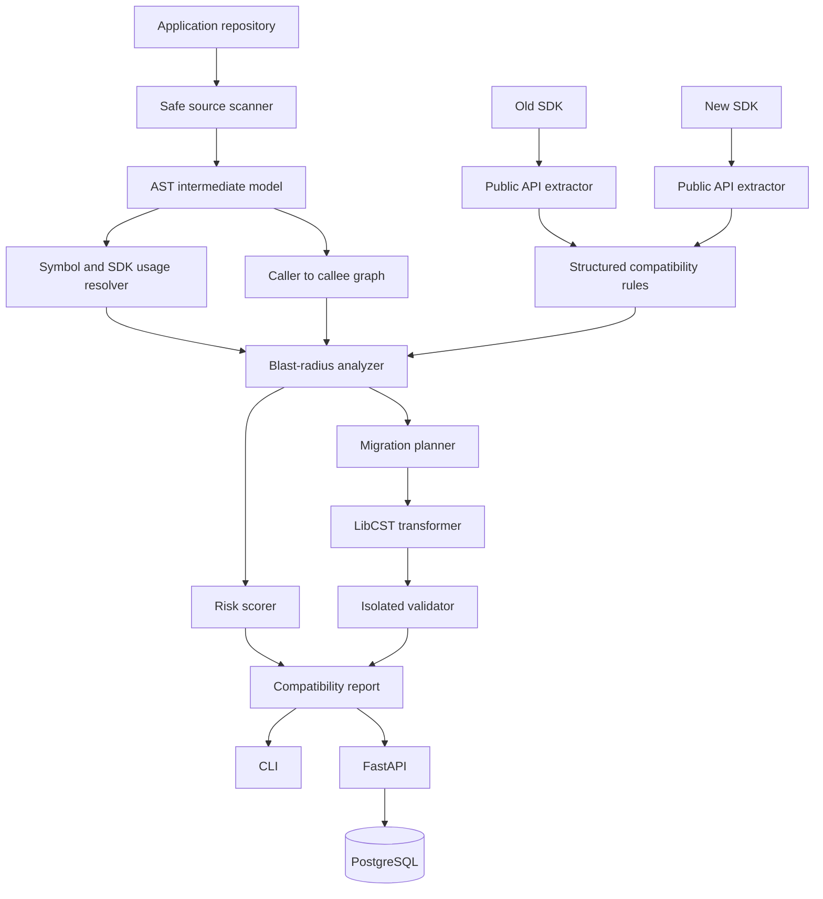

# Architecture

The dependency direction is inward. `domain.py`, `analysis`, `compatibility`, and `migration` have no
dependency on FastAPI or SQLAlchemy. The application service composes deterministic core components;
CLI, HTTP, and persistence are replaceable adapters.

One process is intentional for V1. NetworkX holds the graph in memory. SQL stores the immutable report
plus normalized API-version, change, finding, blast-radius, and migration records. Alembic owns
relational schema evolution, and Docker Compose blocks API startup until migrations succeed.
